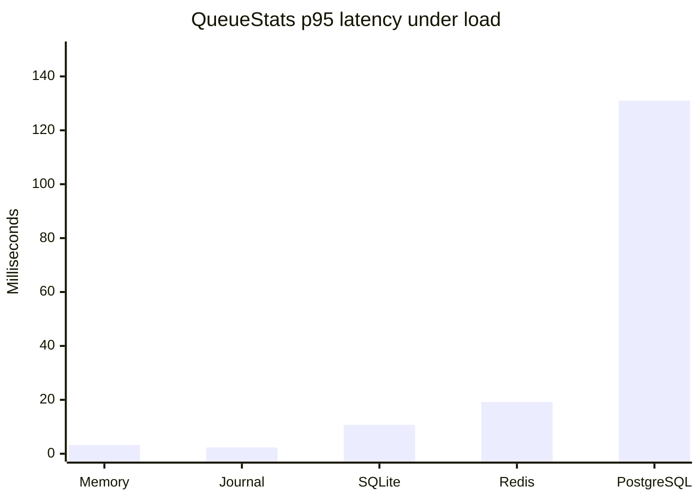

# MapReduce load and stats results — 2026-08-28

These measurements run the same deterministic 1,000-document word-count job
through gRPC for every backend. Each sample contains three complete jobs with 16
mappers and four reducers. Values are medians of three independent samples;
ranges show the lowest and highest sample.

## Throughput

| Backend | Baseline docs/s | Stats every 250 ms | Difference | Stats every 5 s | Difference |
| --- | ---: | ---: | ---: | ---: | ---: |
| Memory | 297.9 (246.0–299.3) | 299.0 (246.0–299.1) | +0.4% | 296.9 (224.7–298.6) | -0.3% |
| Journal | 286.6 (263.9–290.0) | 264.1 (238.5–288.4) | -7.9% | 288.2 (263.5–290.6) | +0.6% |
| SQLite | 101.9 (101.7–112.9) | 100.5 (84.4–104.1) | -1.4% | 113.0 (104.7–113.2) | +10.9% |
| Redis 7 | 92.0 (80.0–94.5) | 98.8 (89.0–103.6) | +7.5% | 99.7 (80.3–101.5) | +8.4% |
| PostgreSQL 17 | 38.3 (33.2–44.2) | 38.2 (37.4–39.5) | -0.4% | 39.7 (35.4–41.1) | +3.7% |

Within each backend, the bars below are baseline, 250 ms stats, and five-second
stats from left to right. The chart shows medians; the table remains the source
for sample ranges.

```mermaid
xychart-beta
    title "MapReduce throughput medians"
    x-axis [Memory, Journal, SQLite, Redis, PostgreSQL]
    y-axis "Documents per second" 0 --> 320
    bar [297.9, 286.6, 101.9, 92.0, 38.3]
    bar [299.0, 264.1, 100.5, 98.8, 38.2]
    bar [296.9, 288.2, 113.0, 99.7, 39.7]
```



The ranges overlap for every sampling mode. In particular, the apparent gains
with five-second polling are not evidence that polling improves throughput.
They expose the amount of run-to-run noise in this workload.

## `QueueStats` latency under load

The 250 ms mode produced about four calls per second and enough observations to
describe latency. Values below are medians across the three samples; the range
is the range of the corresponding per-sample percentile.

| Backend | p50 | p95 | p99 | Maximum |
| --- | ---: | ---: | ---: | ---: |
| Memory | 329 µs (297–349) | 3.26 ms (1.96–3.50) | 4.15 ms (3.88–8.49) | 14.6 ms (10.7–29.2) |
| Journal | 339 µs (339–362) | 2.34 ms (1.21–3.17) | 7.83 ms (1.62–17.1) | 17.2 ms (5.29–19.0) |
| SQLite | 2.09 ms (1.95–2.90) | 10.7 ms (6.73–12.7) | 17.3 ms (11.2–17.8) | 23.1 ms (18.9–27.9) |
| Redis 7 | 1.06 ms (1.00–1.27) | 19.2 ms (11.6–23.6) | 30.7 ms (26.5–32.5) | 40.5 ms (39.3–47.0) |
| PostgreSQL 17 | 3.43 ms (3.38–3.46) | 131 ms (121–142) | 169 ms (162–171) | 229 ms (195–299) |



The medians are much smaller than the tails. A periodic stats collector should
therefore keep at most one request in flight, as this benchmark does, rather
than starting overlapping calls on a fixed wall-clock schedule.

## What this result does and does not show

- Polling `QueueStats` every 250 ms did not produce a repeatable throughput
  regression across the three samples. Journal's median fell 7.9%, but its
  sampled ranges overlap substantially.
- SQLite's baseline and 250 ms medians differ by only 1.4%. This flatter result
  required fresh processes per mode, a longer 1,000-document job, and rotated
  backend/mode order; shorter grouped runs were strongly affected by heap, GC,
  cache, and machine-time order.
- The workload's document rate is end-to-end, not a storage-only measurement.
  Both map and reduce phase completion are checked once per second, adding up to
  roughly two seconds of coarse tail latency to fast runs.
- Notification behavior is also included. Memory, journal, Redis, and SQLite
  use local `subq` wakeups. PostgreSQL's waiter wraps `subq` and locally wakes
  modifications made through the benchmark gateway, while also supporting
  cross-process `LISTEN/NOTIFY`. The PostgreSQL readiness heartbeat is disabled;
  normal MapReduce tasks are inserted ready immediately, so time-passage
  readiness should not materially affect these successful runs.
- Most map and reduce input tasks are present as a backlog. Notifications have
  their greatest opportunity to affect the incrementally produced result
  queues and phase tails, rather than steady-state input-task claiming. This
  benchmark cannot attribute a throughput difference specifically to wakeups.

A separate ready-task handoff benchmark, or a native-notification versus common
fixed-poll comparison, would be the appropriate way to isolate notification
latency.

## Comparability boundaries

- Every variant uses the same public EntroQ API through an in-process `bufconn`
  gRPC transport, not a real network.
- SQLite uses WAL mode with `synchronous=FULL`; journaled eqmem writes its normal
  WAL; Redis 7 does not enable AOF persistence; PostgreSQL 17 uses the
  testcontainer defaults.
- Every backend/mode/sample combination runs in a fresh Go process. Runs are
  sequential, and backend and mode order rotate between samples.
- Final word-count results are verified after the benchmark timer stops.

## Command

```sh
GOCACHE=/tmp/entroq-gocache \
  ENTROQ_LOAD_BENCHTIME=3x \
  ENTROQ_LOAD_BENCHCOUNT=3 \
  ./scripts/benchmark-mapreduce.sh all
```
