# Backend benchmark results — 2026-08-28

These measurements compare the common public-API scenarios implemented in
[`backend.go`](backend.go). They were collected on Linux/amd64 with an Intel
Xeon Platinum 8259CL and `GOMAXPROCS=4`.

Values are medians from three 500 ms samples. Redis and PostgreSQL were rerun
with each sample in a fresh process; backend order rotated between samples. The
gRPC table measures every backend through the same in-process `bufconn`
transport.

Memory, journal, and SQLite were refreshed after the set-based SQLite and eqmem
claim-timing changes. Redis and PostgreSQL retain the immediately preceding
samples because their implementations did not change.

## Direct backend results

| Scenario | Memory | Journal | SQLite | Redis | PostgreSQL 17 |
| --- | ---: | ---: | ---: | ---: | ---: |
| Empty `TryClaim` | 0.41 µs | 0.36 µs | 334 µs | 240 µs | 808 µs |
| Claim/complete, serial | 6.74 µs | 33.4 µs | 737 µs | 1.14 ms | 3.95 ms |
| Claim/complete, parallel | 11.8 µs | 42.2 µs | 715 µs | 678 µs | 3.40 ms |
| Atomic handoff, 1 task | 5.45 µs | 20.0 µs | 178 µs | 870 µs | 5.02 ms |
| Atomic handoff, 32 tasks | 117 µs | 313 µs | 1.47 ms | 4.64 ms | 8.75 ms |
| `QueueStats`, depth 1,000 | 37.0 µs | 29.6 µs | 1.18 ms | 499 µs | 1.29 ms |
| `QueueStats`, depth 10,000 | 570 µs | 535 µs | 12.3 ms | 469 µs | 5.31 ms |
| `Tasks`, depth 1,000 | 300 µs | 340 µs | 4.96 ms | 17.4 ms | 10.4 ms |
| `Tasks`, depth 10,000 | 5.34 ms | 5.28 ms | 44.6 ms | 149 ms | 63.2 ms |

## Results through gRPC

| Scenario | Memory | Journal | SQLite | Redis | PostgreSQL 17 |
| --- | ---: | ---: | ---: | ---: | ---: |
| Empty `TryClaim` | 69.1 µs | 71.0 µs | 531 µs | 517 µs | 882 µs |
| Claim/complete, serial | 296 µs | 355 µs | 1.13 ms | 2.16 ms | 5.42 ms |
| Claim/complete, parallel | 169 µs | 157 µs | 1.08 ms | 1.03 ms | 4.94 ms |
| Atomic handoff, 1 task | 175 µs | 200 µs | 446 µs | 1.40 ms | 4.08 ms |
| Atomic handoff, 32 tasks | 1.08 ms | 1.38 ms | 2.50 ms | 5.44 ms | 6.56 ms |
| `QueueStats`, depth 1,000 | 146 µs | 140 µs | 1.47 ms | 719 µs | 1.43 ms |
| `QueueStats`, depth 10,000 | 971 µs | 928 µs | 13.3 ms | 722 µs | 6.74 ms |
| `Tasks`, depth 1,000 | 17.0 ms | 11.2 ms | 19.5 ms | 29.2 ms | 26.0 ms |
| `Tasks`, depth 10,000 | 116 ms | 118 ms | 198 ms | 492 ms | 320 ms |

For each backend, direct is the left bar and gRPC is the right bar. Lower is
better. This focuses on the serial claim/complete path; the tables retain the
other workload shapes.

```mermaid
xychart-beta
    title "Serial claim and complete latency"
    x-axis [Memory, Journal, SQLite, Redis, PostgreSQL]
    y-axis "Milliseconds per operation" 0 --> 6
    bar [0.00674, 0.0334, 0.737, 1.14, 3.95]
    bar [0.296, 0.355, 1.13, 2.16, 5.42]
```



`tryclaims/op` was 1.000 for every variant. Moving eqmem's availability-time
sample inside the queue lock removed its former small transient misses under
parallel contention.

## Interpretation

- Journaled eqmem was roughly 10× faster than SQLite for a one-task atomic
  handoff and about 20× faster for a serial claim/complete cycle.
- SQLite was substantially faster than containerized Redis and PostgreSQL for
  small serial write transactions.
- Parallelism did not improve SQLite throughput, as expected from its single
  writer. Redis and PostgreSQL benefited from concurrent requests.
- Set-based SQLite dependency loads and mutations reduced the 32-task handoff
  median from 3.77 ms to 1.47 ms; it is now substantially faster than Redis in
  this scenario.
- SQLite task listings were competitive with the external databases. At depth
  10,000 it was close to PostgreSQL and considerably faster than Redis.
- SQLite `QueueStats` scaled linearly. Redis's maintained counters made it
  effectively independent of queue depth, while PostgreSQL overtook SQLite at
  depth 10,000.
- SQLite allocated about 17 objects per listed task, versus roughly two for
  eqmem. Large gRPC listings were dominated by protobuf/RPC allocation and
  copying.

Through gRPC, fixed RPC and protobuf costs narrow the differences between the
local backends for small operations. SQLite remained faster than Redis and
PostgreSQL for claim/complete and handoff scenarios, including the now-batched
32-task handoff. Redis remained faster for `QueueStats`. Large task listings
were dominated by protobuf conversion, allocation, and copying; the 10,000-task
samples completed only a few iterations each and are correspondingly noisy.

## Comparability boundaries

These are default-configuration implementation profiles, not a ranking adjusted
for equivalent durability or networking:

- SQLite used WAL mode with `synchronous=FULL`.
- Journaled eqmem wrote its normal WAL.
- PostgreSQL used the repository's PostgreSQL 17 testcontainer defaults.
- Redis used the repository's Redis 7 testcontainer without AOF persistence.
- Every gRPC variant used an EntroQ service over `bufconn`, not a real network.

Setup was outside the benchmark timer. Each scenario used isolated queues and
the same payloads seeded through the public EntroQ API. Claim/complete scenarios
maintained steady queue depth by atomically deleting each claimed task and
inserting its replacement.

## Commands

The refreshed local runs used:

```sh
GOCACHE=/tmp/entroq-gocache \
  ENTROQ_BENCHTIME=500ms \
  ENTROQ_BENCHCOUNT=3 \
  ./scripts/benchmark-backends.sh eqmem eqsqlite

GOCACHE=/tmp/entroq-gocache \
  ENTROQ_BENCHTIME=500ms \
  ENTROQ_BENCHCOUNT=3 \
  ./scripts/benchmark-backends.sh eqgrpc
```

Redis and PostgreSQL were then collected as three independent processes per
backend, including both their direct and gRPC profiles:

```sh
GOCACHE=/tmp/entroq-gocache \
  ENTROQ_BENCHTIME=500ms \
  ENTROQ_BENCHCOUNT=3 \
  ./scripts/benchmark-backends.sh eqredis eqpg
```

For a stronger comparison, collect at least five longer samples:

```sh
ENTROQ_BENCHTIME=3s ENTROQ_BENCHCOUNT=5 ./scripts/benchmark-backends.sh all
```

Repeated raw output can be compared with `benchstat`.

## SQLite review findings relevant to performance

The batched rerun also corrected `QueueStats` so an unclaimed future task is no
longer counted as claimed. Two earlier readiness findings remain before treating
the experimental backend as ready:

1. A write blocked by another SQLite writer does not honor a short context
   deadline promptly. A 50 ms deadline returned after roughly five seconds,
   matching the configured SQLite busy timeout.
2. One of twenty simultaneous cold opens failed while enabling WAL with
   `SQLITE_BUSY`. WAL/schema initialization needs the same context-aware retry
   policy as ordinary writes.

A covering `(queue, at_ms, claims)` index remains worth a selective A/B
benchmark, but no index change was made without that evidence.
